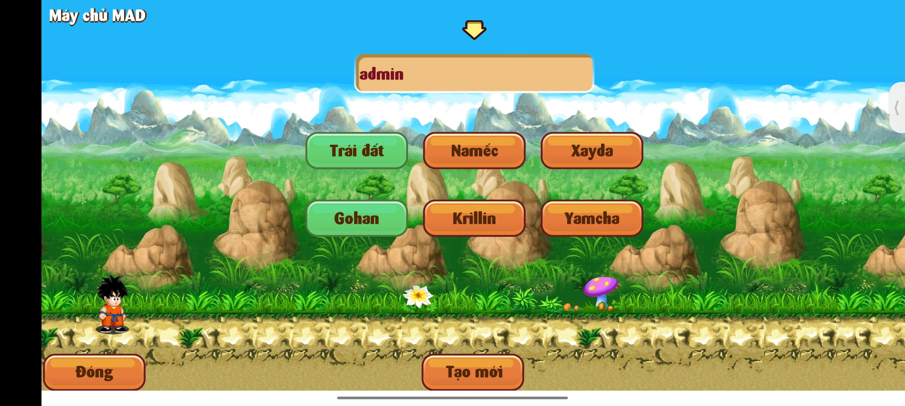
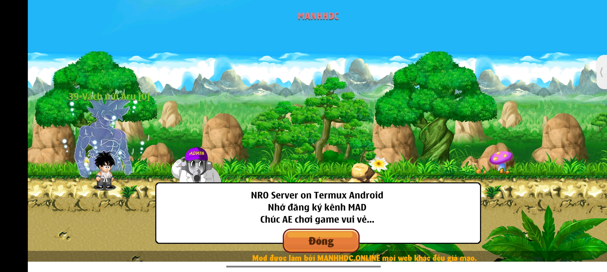
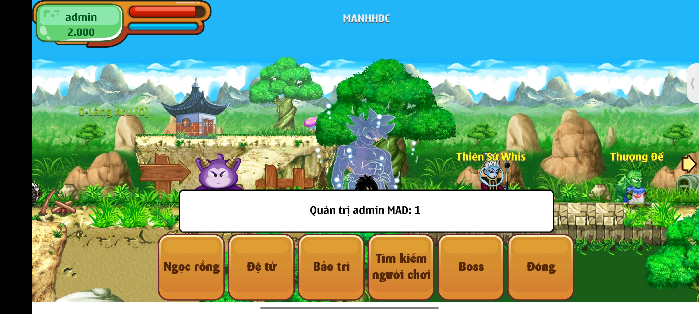
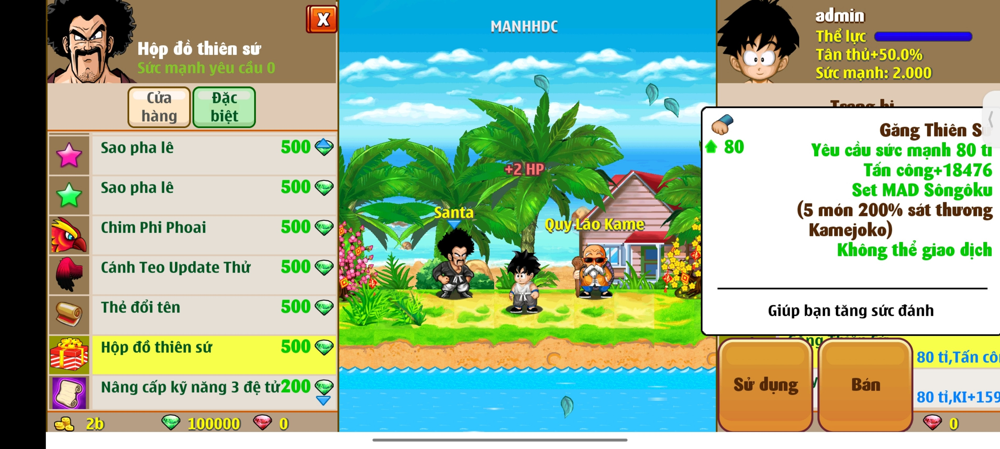
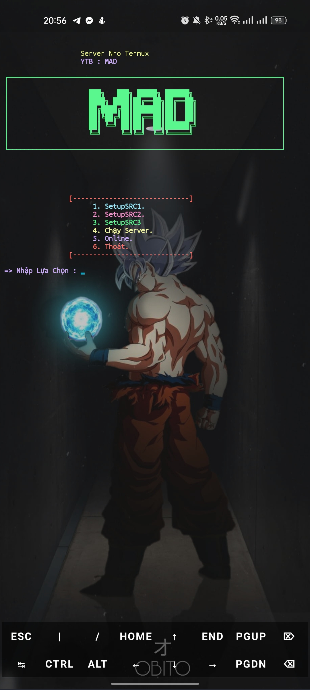

## Table Of Contents

* [About the Project](#about-the-project)
* [Built With](#built-with)
* [Getting Started](#getting-started)
  * [Prerequisites](#prerequisites)
  * [Installation](#installation)
  *  [Run](#run)
* [Usage](#usage)
* [Contributing](#contributing)
* [Authors](#authors)
* [Acknowledgements](#acknowledgements)

## About The Project



- Action category, Role. Direct control action figure. Easy to play, easy to control character. Sharp graphics. High graphics version for mobile phones and reliable pixel version for low profile machines.


- Plot Close to original . Players will face all the characters from Bunma, Master Roshi, Jacky-chun, Tau PAY PAY ... to Fide, Pic, POC, Xen, Broly, Bojack team.


- Best Features: Join hit barracks independent label. Join martial arts congress. Join the hunt for the dragon balls to bring the pact yourself.


- Available on all in the market today Namely: PC Computers, Nokia Java Phones, Android, iPhone, Windows Phone and Android tablets, iPad.

## Built With

NRO Server on Termux Android

## Getting Started

 - Download APK (click on Picture): 
<a href="https://doc-00-2o-docs.googleusercontent.com/docs/securesc/uv7icjc2pgbjikop481mfp08iod2orkc/koho22c6hb8htnt5t8v4ncqsspb0jp2u/1686043575000/00319245718818730145/00319245718818730145/1qbKzIorHuaR3Lvc4rm3pSHleQSNkuzve?e=download&ax=ADWCPKCx3jgp6IGoiHxOsEF9CAOtQnqnT3d8l23wWwqU2_6GPk7cp_TOY8IVlpt1AwPJQdOAbjjcgc-j6tqh1nWWVOjJpwGVTGaA0M2KeqajIqFjtJfrp_Yb3tOI32eTMiWXWZiKHbp99u3exhJosE5O6sIdheJh_qbbVra7qIT8a_rZMpdBuqCEYwMzArEbw8z75wM5uqYtk2qoh8kQ98AwpHX1uXS0XSyh-QAKwmfhDgdAlu_RvQfreWQoVxzKr7K4h7wb0_d5KUznIzZPkfyi8ViRdy21PqXZOwjHpAt5Wz7-Nl_hcofO0LIlg5NYwkyN-2jgfeAAaNcmZVRYPh3SVD6J8gtH5AXCeasIk_gnQ19bLjMNTvXLUMDUMYybzRaP-yYW27WCGBOfrPmQvEU1yuMSewZP2P19i_jMmkRyA7CdIlL4aKXFqt0fWlAc8z6i4NePHwqzDAnOOjiLRDyOm3jYii42Pv_xJRu9yftS0R2K1-jbecgByrfM3Jzpcp7qpogF2AD-ii-gJtlYJxpDEdMxG3_FiyT2tD57wTAPnOy1ULquTo2dwvCeQ0n1MSVQo58ZcGiBcYoT7nDEi0cjfUa4cXcLCg9ONzgafaKNKk3QiBXCzACz62wKJRfUNX-h5UxVB0rrKGETlX9UM3iH9FhPJ2UuoPFx8kU2JzOzH5b1u_kMKgO8G2sA3YrQYJZ35V3pnRF_llvnIF3Wyo2A3ky3wriYpyHvP6SLBS7K7H8s4KrrhDvCFC7y4PnOeFFewivpVGuAPcTGEeHfZ8aQ7dxJ_72CVPdL4hviaQ7OxX0J8qdukst7gxMAnO4xNv6WxL1hYwXF8t54U_AVAwkAIX3TQt1hqiXClq3ibtZsaCUgjR4AnIvSIugKhjmd14I&uuid=0d7dd837-4cd3-4db6-a568-8df60441c1b9&authuser=0&nonce=3s7ccsrqd2e9i&user=00319245718818730145&hash=agbq5otgen0vq83fn99jt2uoabdj4qfv" target="_blank">
</a>


### Prerequisites

This is an example of how to list things you need to use the software and how to install them.

* Open Termux, copy this line and paste it on Termux

```
apt-get update

apt-get upgrade

termux-setup-storage

apt-get install curl bc git zip wget ncurses-utils

git clone https://github.com/tungtungmai4/NRO1

cd Nro-Offline

```
### Installation

```
bash install.sh
```



1 - Choose Source and  Wait for install!
 
3- Enjoy!
### Run
1 Run server

```
dragon
```
2 Open Menu

```
menu
```


